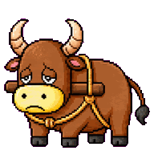

# Codex Pets

Codex pets 是 Codex 桌面应用里的小型动画伙伴。每个 pet 由一个元数据文件和一张精灵图集组成，Codex 可以将它加载为应用中的自定义角色。

这个仓库收集了我的自定义 Codex pets。使用 `Add` 列中的命令即可在本地安装对应的 pet。

## Pets

| Preview | ID | Name | Description | Add |
| --- | --- | --- | --- | --- |
|  | `frierencodex` | FrierenCodex | Q版芙莉莲风格的冷静工程师宠物，带一本无字法典与终端工具气质。 | `npx codex-pets add frierencodex` |
|  | `jige-kunkun` | 鸡哥（坤坤） | 一个篮球主题的圆润黄色小鸡 Codex 宠物，昵称鸡哥（坤坤）。 | `npx codex-pets add jige-kunkun` |
|  | `xia-ren` | 虾仁 | 戴草帽、熊猫耳、表情包风格的虾仁宠物。 | `npx codex-pets add xia-ren` |
|  | `hardworking-old-ox` | Hardworking Old Ox | 像素画风格的苦命老黄牛宠物，棕色身体、奶黄色鼻口部、大弯角和短腿，疲惫但一直干活，拥有九种 Codex 宠物状态动画。 | `npx codex-pets add hardworking-old-ox` |

## Structure

Each pet lives in its own directory:

```text
<pet-id>/
  pet.json
  spritesheet.webp
```

`pet.json` defines the pet metadata:

```json
{
  "id": "pet-id",
  "displayName": "Pet Name",
  "description": "One short sentence.",
  "spritesheetPath": "spritesheet.webp"
}
```

The spritesheets are WebP atlases using the Codex pet layout:

```text
1536x1872
8 columns x 9 rows
192x208 per frame
```
